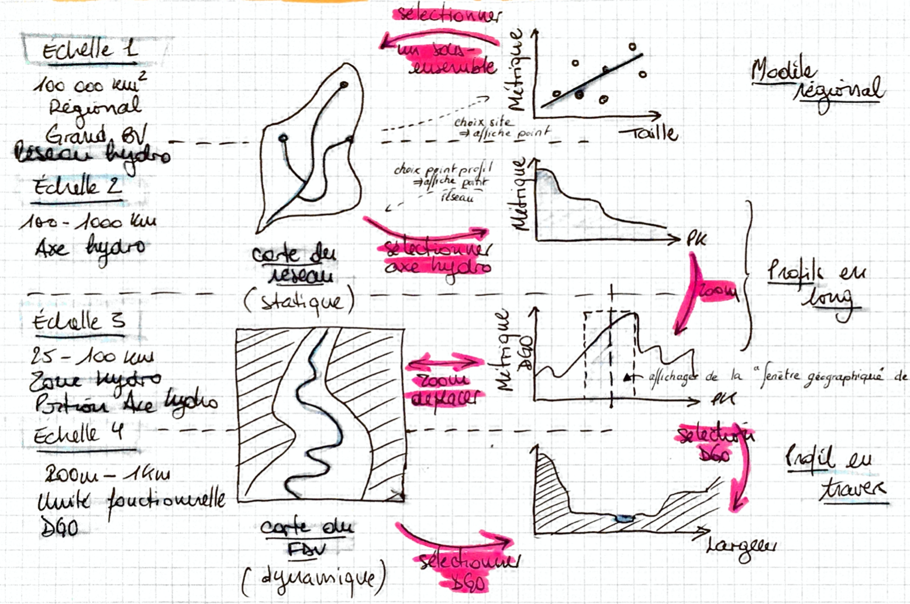

# fct-shiny
Shiny visualization interface



## Running the application with Docker on localhost

1. Create and activate a virtual environment for docker-compose :

```bash
python3 -m venv py-docker
. py-docker/bin/activate
python -m pip install docker-compose
```

2. Build Docker image with required R dependencies :

```bash
# in directory fct-shiny/docker
docker build .
```

3. Create `.env` file next to `docker-compose.yml` :

```bash
QGS_USER=1000
QGS_SERVER_PORT=127.0.0.1:8010
QGS_DATA=/path/to/qgis/projects
FCT_DATA=/path/to/netcdf/data
APP_ROOT=/path/to/fct-shiny
```

4. Run the application

```bash
docker-compose up
```

[http://localhost:3838](http://localhost:3838)
